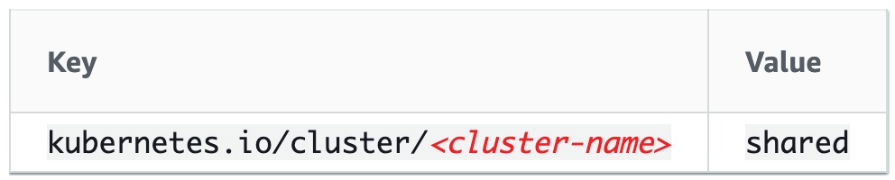
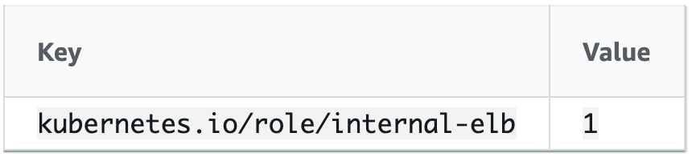
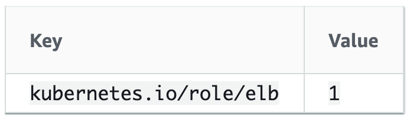

# Pimp your EKS cluster on Fargate

- [Introduction](#Introduction)
- [Prerequisites](#Prerequisites)
- [Cluster creation](#Cluster-creation)
- [ALB Ingress Controller on Amazon EKS](#ALB-Ingress-Controller-on-Amazon-EKS)
- [Deploy a sample application](#Deploy-a-sample-application)
- [Route53 Integration](#Route53-Integration)
- [Horizontal Pod Autoscaler](#Horizontal-Pod-Autoscaler)
  - [Test the autoscaler](#Test-the-autoscaler)
- [Monitoring with Prometheus and Grafana](#Monitoring-with-Prometheus-and-Grafana)
  - [Prometheus](#Prometheus)
  - [Grafana](#Grafana)
- [Logging on CloudWatch Logs](#Logging-on-CloudWatch-Logs)

---

## Introduction

Setting up a Kubernetes cluster is not an easy task. Amazon EKS greatly simplify the creation and the management of a Kubernetes (k8s) cluster, and used together with AWS Fargate removes the need to provision and manage servers part of the cluster.

The purpose of this post is to guide you step by step in the creation of the cluster and the configuration of the following components:

- OIDC Provider _(k8s services accounts integrated with AWS IAM)_
- ALB Ingress Controller _(k8s ingresses integrated with AWS ALB)_
- External DNS _(k8s services and ingresses integrated with Amazon Route53)_
- Horizontal Pod Autoscaler _(automatically scales the number of pods according to CPU usage)_
- Pod Monitoring for EKS Fargate with Prometheus and Grafana _(monitoring and alerting for k8s infrastructure and applications)_
- Pod Logging for EKS Fargate _(logging integration for k8s applications with Amazon CloudWatch Logs)_

---

## Prerequisites

In order to follow this guide you will need the following tools:

- [kubectl](https://kubernetes.io/docs/tasks/tools/install-kubectl/) - Kubernetes CLI tool
- [eksctl](https://github.com/weaveworks/eksctl) - a simple CLI tool for creating clusters on EKS
- [aws-iam-authenticator](https://docs.aws.amazon.com/eks/latest/userguide/install-aws-iam-authenticator.html) - a tool to use AWS IAM credentials to authenticate to a Kubernetes cluster
- [helm](https://github.com/helm/helm) - package manager for Kubernetes
- [jq](https://stedolan.github.io/jq/) - a lightweight and flexible command-line JSON processor
- _\[OPTIONAL\]_ [k9s](https://github.com/derailed/k9s) - a terminal UI to interact with your Kubernetes clusters

Once installed helm, you need to add a chart repository as follows helm:

```sh
helm repo add stable https://kubernetes-charts.storage.googleapis.com
helm repo update
```

---

## Cluster creation

Let's start creating our cluster. To run our containers on AWS Fargate, we need to create one or more Fargate profiles and define which namespaces are going to be deployed with these profiles.

Open a file named `cluster.yaml` where we define, the name of the cluster, the region where our cluster will be deployed, and the Fargate profiles of our choice.

```yaml
kind: ClusterConfig

metadata:
  name: eks-cluster
  region: eu-west-1

fargateProfiles:
  - name: default
    selectors:
      - namespace: default
  - name: kube-system
    selectors:
      - namespace: kube-system
```

To create our cluster and the profiles we use the eksctl tool as follows:

```sh
eksctl create cluster -f cluster.yaml
```

By default, eksctl will create a new VPC and a number of subnets used by your Fargate containers.

In some scenarios, you might want to use your own VPC and subnets which you have already configured:

- You need to have at least 2 public and 2 private subnets

- **Tag the VPC and the subnets in your VPC** containing the subnets you specify in the following way so that Kubernetes can discover it

  <p align="center"></p>

- **Key**: The `<cluster-name>` value matches your Amazon EKS cluster as
  defined in `cluster.yaml`
- **Value**: The `shared` value allows more than one cluster to use this
  subnet.

- Tag the private subnets in the following way so that Kubernetes knows it can use the subnets for internal load balancers.

  <p align="center"></p>

- Tag the public subnets in your VPC so that Kubernetes knows to use only those subnets for external load balancers

  <p align="center"></p>

- Add the following block to `cluster.yaml`, where you specify the ids of your public and private subnets in the respective AZ, before running the `eksctl` command:

```yaml
vpc:
  subnets:
    private:
      eu-west-1a: { id: subnet-0ff156e0c4a6d300c }
      eu-west-1b: { id: subnet-0549cdab573695c03 }
    public:
      eu-west-1a: { id: subnet-0ff156e0c4a6d300b }
      eu-west-1b: { id: subnet-0549cdab573695c43 }
```

---

## ALB Ingress Controller on Amazon EKS

In order to trigger the creation of an Application Load Balancer (currently the only support by EKS on Fargate) and the necessary supporting AWS resources whenever a specific Ingress resource is created on the cluster, we need to configure the [ALB Ingress Controller for Kubernetes](https://github.com/kubernetes-sigs/aws-alb-ingress-controller).

Create the following `iam-policy.json` file:

```json
{
  "Version": "2012-10-17",
  "Statement": [
    {
      "Effect": "Allow",
      "Action": [
        "acm:DescribeCertificate",
        "acm:ListCertificates",
        "acm:GetCertificate"
      ],
      "Resource": "*"
    },
    {
      "Effect": "Allow",
      "Action": [
        "ec2:AuthorizeSecurityGroupIngress",
        "ec2:CreateSecurityGroup",
        "ec2:CreateTags",
        "ec2:DeleteTags",
        "ec2:DeleteSecurityGroup",
        "ec2:DescribeAccountAttributes",
        "ec2:DescribeAddresses",
        "ec2:DescribeInstances",
        "ec2:DescribeInstanceStatus",
        "ec2:DescribeInternetGateways",
        "ec2:DescribeNetworkInterfaces",
        "ec2:DescribeSecurityGroups",
        "ec2:DescribeSubnets",
        "ec2:DescribeTags",
        "ec2:DescribeVpcs",
        "ec2:ModifyInstanceAttribute",
        "ec2:ModifyNetworkInterfaceAttribute",
        "ec2:RevokeSecurityGroupIngress"
      ],
      "Resource": "*"
    },
    {
      "Effect": "Allow",
      "Action": [
        "elasticloadbalancing:AddListenerCertificates",
        "elasticloadbalancing:AddTags",
        "elasticloadbalancing:CreateListener",
        "elasticloadbalancing:CreateLoadBalancer",
        "elasticloadbalancing:CreateRule",
        "elasticloadbalancing:CreateTargetGroup",
        "elasticloadbalancing:DeleteListener",
        "elasticloadbalancing:DeleteLoadBalancer",
        "elasticloadbalancing:DeleteRule",
        "elasticloadbalancing:DeleteTargetGroup",
        "elasticloadbalancing:DeregisterTargets",
        "elasticloadbalancing:DescribeListenerCertificates",
        "elasticloadbalancing:DescribeListeners",
        "elasticloadbalancing:DescribeLoadBalancers",
        "elasticloadbalancing:DescribeLoadBalancerAttributes",
        "elasticloadbalancing:DescribeRules",
        "elasticloadbalancing:DescribeSSLPolicies",
        "elasticloadbalancing:DescribeTags",
        "elasticloadbalancing:DescribeTargetGroups",
        "elasticloadbalancing:DescribeTargetGroupAttributes",
        "elasticloadbalancing:DescribeTargetHealth",
        "elasticloadbalancing:ModifyListener",
        "elasticloadbalancing:ModifyLoadBalancerAttributes",
        "elasticloadbalancing:ModifyRule",
        "elasticloadbalancing:ModifyTargetGroup",
        "elasticloadbalancing:ModifyTargetGroupAttributes",
        "elasticloadbalancing:RegisterTargets",
        "elasticloadbalancing:RemoveListenerCertificates",
        "elasticloadbalancing:RemoveTags",
        "elasticloadbalancing:SetIpAddressType",
        "elasticloadbalancing:SetSecurityGroups",
        "elasticloadbalancing:SetSubnets",
        "elasticloadbalancing:SetWebACL"
      ],
      "Resource": "*"
    },
    {
      "Effect": "Allow",
      "Action": [
        "iam:CreateServiceLinkedRole",
        "iam:GetServerCertificate",
        "iam:ListServerCertificates"
      ],
      "Resource": "*"
    },
    {
      "Effect": "Allow",
      "Action": ["cognito-idp:DescribeUserPoolClient"],
      "Resource": "*"
    },
    {
      "Effect": "Allow",
      "Action": [
        "waf-regional:GetWebACLForResource",
        "waf-regional:GetWebACL",
        "waf-regional:AssociateWebACL",
        "waf-regional:DisassociateWebACL"
      ],
      "Resource": "*"
    },
    {
      "Effect": "Allow",
      "Action": ["tag:GetResources", "tag:TagResources"],
      "Resource": "*"
    },
    {
      "Effect": "Allow",
      "Action": ["waf:GetWebACL"],
      "Resource": "*"
    },
    {
      "Effect": "Allow",
      "Action": [
        "shield:DescribeProtection",
        "shield:GetSubscriptionState",
        "shield:DeleteProtection",
        "shield:CreateProtection",
        "shield:DescribeSubscription",
        "shield:ListProtections"
      ],
      "Resource": "*"
    }
  ]
}
```

Create an IAM OIDC provider and associate it with your cluster:

```sh
eksctl utils associate-iam-oidc-provider --region eu-west-1 --cluster eks-cluster \
 --approve
```

Create an IAM policy called `ALBIngressControllerIAMPolicy` for the ALB Ingress Controller pod that allows it to make calls to AWS APIs on your behalf:

```sh
aws iam create-policy --policy-name ALBIngressControllerIAMPolicy \
 --policy-document file://iam-policy.json
```

We need to define a Kubernetes service account named `alb-ingress-controller` in the `kube-system` namespace, cluster role, and a cluster role binding for the ALB Ingress Controller. Create a file named `rbac-role.yaml` as follows:

```yaml
---
apiVersion: rbac.authorization.k8s.io/v1
kind: ClusterRole
metadata:
  labels:
    app.kubernetes.io/name: alb-ingress-controller
  name: alb-ingress-controller
rules:
  - apiGroups:
      - ""
      - extensions
    resources:
      - configmaps
      - endpoints
      - events
      - ingresses
      - ingresses/status
      - services
      - pods/status
    verbs:
      - create
      - get
      - list
      - update
      - watch
      - patch
  - apiGroups:
      - ""
      - extensions
    resources:
      - nodes
      - pods
      - secrets
      - services
      - namespaces
    verbs:
      - get
      - list
      - watch
---
apiVersion: rbac.authorization.k8s.io/v1
kind: ClusterRoleBinding
metadata:
  labels:
    app.kubernetes.io/name: alb-ingress-controller
  name: alb-ingress-controller
roleRef:
  apiGroup: rbac.authorization.k8s.io
  kind: ClusterRole
  name: alb-ingress-controller
subjects:
  - kind: ServiceAccount
    name: alb-ingress-controller
    namespace: kube-system
---
apiVersion: v1
kind: ServiceAccount
metadata:
  labels:
    app.kubernetes.io/name: alb-ingress-controller
  name: alb-ingress-controller
  namespace: kube-system
```

And apply it with kubectl:

```sh
kubectl apply -f rbac-role.yaml
```

Create an IAM role for the ALB ingress controller and attach the role to the service account created in the previous step. Change `<ACCOUNT_ID>` with the id of your AWS Account and `<AWS_REGION>` with the region where the cluster has been created:

```yaml
eksctl create iamserviceaccount --region <AWS_REGION> \
--name alb-ingress-controller \
--namespace kube-system \
--cluster eks-cluster \
--attach-policy-arn arn:aws:iam::<ACCOUNT_ID>:policy/ALBIngressControllerIAMPolicy \
--override-existing-serviceaccounts \
--approve
```

Create a file `alb-ingress-controller.yaml` to define the alb-ingress-controller deployment, replacing `<CLUSTER_NAME>` with the name of your cluster, `<VPC_ID>` with the id of the VPC used by the cluster and `<AWS_REGION>` with the region where the cluster as been created:

```yaml
apiVersion: apps/v1
kind: Deployment
metadata:
  labels:
    app.kubernetes.io/name: alb-ingress-controller
  name: alb-ingress-controller
  namespace: kube-system
spec:
  selector:
    matchLabels:
      app.kubernetes.io/name: alb-ingress-controller
  template:
    metadata:
      labels:
        app.kubernetes.io/name: alb-ingress-controller
    spec:
      containers:
        - name: alb-ingress-controller
          args:
            - --ingress-class=alb
            - --cluster-name=<CLUSTER_NAME>
            - --aws-vpc-id=<VPC_ID>
            - --aws-region=<AWS_REGION>
            # - --aws-api-debug
            # - --aws-max-retries=10
          env:
            #- name: AWS_ACCESS_KEY_ID
            #  value: KEYVALUE
            #- name: AWS_SECRET_ACCESS_KEY
            #  value: SECRETVALUE
          image: docker.io/amazon/aws-alb-ingress-controller:v1.1.6
      serviceAccountName: alb-ingress-controller
```

Deploy the ALB Ingress Controller with the following command:

```sh
kubectl apply -f alb-ingress-controller.yaml
```

Verify that the alb-ingress-controller is running and there are no errors in logs:

```sh
kubectl get pods -n kube-system | grep alb-ingress-controller
alb-ingress-controller-688dd94984-m6554   1/1     Running   0          4d22h
```

## Deploy a sample application

We deploy the game [2048](https://play2048.co/) as a sample application to verify that the ALB Ingress Controller creates an Application Load Balancer as a result of the Ingress object.

First we create a new Fargate profile for this application:

```sh
eksctl create fargateprofile --cluster eks-cluster --region eu-west-1 \
 --name 2048-game --namespace 2048-game
```

Create a `2048.yaml` to define our namespace, deployment, service and
ingress:

```yaml
---
apiVersion: v1
kind: Namespace
metadata:
  name: "2048-game"
---
apiVersion: apps/v1
kind: Deployment
metadata:
  name: "2048-deployment"
  namespace: "2048-game"
spec:
  selector:
    matchLabels:
      app: "2048"
  replicas: 5
  template:
    metadata:
      labels:
        app: "2048"
    spec:
      containers:
        - image: alexwhen/docker-2048
          imagePullPolicy: Always
          name: "2048"
          ports:
            - containerPort: 80
---
apiVersion: v1
kind: Service
metadata:
  name: "service-2048"
  namespace: "2048-game"
spec:
  ports:
    - port: 80
      targetPort: 80
      protocol: TCP
  type: NodePort
  selector:
    app: "2048"
---
apiVersion: apps/v1
kind: Deployment
metadata:
  name: "2048-deployment"
  namespace: "2048-game"
spec:
  selector:
    matchLabels:
      app: "2048"
  replicas: 5
  template:
    metadata:
      labels:
        app: "2048"
    spec:
      containers:
        - image: alexwhen/docker-2048
          imagePullPolicy: Always
          name: "2048"
          ports:
            - containerPort: 80
---
apiVersion: extensions/v1beta1
kind: Ingress
metadata:
  name: "2048-ingress"
  namespace: "2048-game"
  annotations:
    kubernetes.io/ingress.class: alb
    alb.ingress.kubernetes.io/scheme: internet-facing
    alb.ingress.kubernetes.io/target-type: ip
  labels:
    app: 2048-ingress
spec:
  rules:
    - http:
        paths:
          - path: /*
            backend:
              serviceName: "service-2048"
              servicePort: 80
```

Apply the manifest file:

```sh
kubectl apply -f 2048.yaml
```

After a few minutes, verify that the Ingress resource was created with the following command.

```sh
kubectl get ingress/2048-ingress -n 2048-game
NAME           HOSTS   ADDRESS                                                                  PORTS   AGE
2048-ingress   *       example-2048game-2048ingr-6fa0-352729433.region-code.elb.amazonaws.com   80      24h
```

Open a browser and navigate to the `ADDRESS` URL from the previous command output to see the sample application.

When you finish experimenting with your sample application, delete it with the following command.

```sh
kubectl delete -f 2048.yaml
```

---

## Route53 Integration

[external-dns](https://github.com/kubernetes-incubator/external-dns) provisions DNS records based on the host information. This project will setup and manage records in Route 53 that point to controller deployed ALBs.

Create a private hosted zone on Route 53 and associate it with the VPC where EKS is running (<https://docs.aws.amazon.com/Route53/latest/DeveloperGuide/hosted-zone-private-creating.html>).

Create the service account:

```sh
eksctl create iamserviceaccount --name external-dns --namespace kube-system --cluster eks-cluster --attach-policy-arn arn:aws:iam::aws:policy/AmazonRoute53FullAccess --override-existing-serviceaccounts --approve --region eu-west-1
```

Create a file `external-dns.yaml` as follows:

```yaml
apiVersion: v1
kind: ServiceAccount
metadata:
  name: external-dns
  namespace: kube-system
---
apiVersion: rbac.authorization.k8s.io/v1beta1
kind: ClusterRole
metadata:
  name: external-dns
rules:
  - apiGroups: [""]
    resources: ["services"]
    verbs: ["get", "watch", "list"]
  - apiGroups: [""]
    resources: ["pods"]
    verbs: ["get", "watch", "list"]
  - apiGroups: ["extensions"]
    resources: ["ingresses"]
    verbs: ["get", "watch", "list"]
  - apiGroups: [""]
    resources: ["nodes"]
    verbs: ["list"]
---
apiVersion: rbac.authorization.k8s.io/v1beta1
kind: ClusterRoleBinding
metadata:
  name: external-dns-viewer
roleRef:
  apiGroup: rbac.authorization.k8s.io
  kind: ClusterRole
  name: external-dns
subjects:
  - kind: ServiceAccount
    name: external-dns
    namespace: kube-system
---
apiVersion: apps/v1
kind: Deployment
metadata:
  name: external-dns
  namespace: kube-system
spec:
  selector:
    matchLabels:
      app: external-dns
  strategy:
    type: Recreate
  template:
    metadata:
      labels:
        app: external-dns
    spec:
      serviceAccountName: external-dns
      containers:
        - name: external-dns
          #image: registry.opensource.zalan.do/teapot/external-dns:v0.5.18
          image: eu.gcr.io/k8s-artifacts-prod/external-dns/external-dns:v0.7.0
          args:
            - --source=service
            - --source=ingress
            - --domain-filter=my-domain.com # will make ExternalDNS see only the hosted zones matching provided domain, omit to process all available hosted zones
            - --provider=aws
            - --policy=upsert-only # would prevent ExternalDNS from deleting any records, omit to enable full synchronization
            - --aws-zone-type=private # only look at public hosted zones (valid values are public, private or no value for both)
            - --registry=txt
            - --txt-owner-id=my-identifier
      securityContext:
        fsGroup: 65534
      volumes:
        - name: token-vol
          projected:
            sources:
              - serviceAccountToken:
                  path: token
```

Edit the `--domain-filter` flag to include your hosted zone(s) and deploy external-dns:

```sh
kubectl apply -f external-dns.yaml
```

Verify it deployed correctly:

```sh
kubectl apply -f external-dns.yaml
```

In order to check if the integration works, you can add the `external-dns.alpha.kubernetes.io/hostname` annotation in the 2048 ingress annotations using the domain created in the private hosted zone:

```yaml
apiVersion: extensions/v1beta1
kind: Ingress
metadata:
  name: "2048-ingress"
  namespace: "2048-game"
  annotations:
    kubernetes.io/ingress.class: alb
    alb.ingress.kubernetes.io/scheme: internet-facing
    alb.ingress.kubernetes.io/target-type: ip
    external-dns.alpha.kubernetes.io/hostname: 2048.my-domain.com # add this new annotation
  labels:
    app: 2048-ingress
spec:
  rules:
    - http:
        paths:
          - path: /*
            backend:
              serviceName: "service-2048"
              servicePort: 80
```

Then, apply it once again with kubectl, and you can check external-dns pod logs again or the Route53 private hosted zone for the new DNS records.

---

## Horizontal Pod Autoscaler

The Kubernetes [Horizontal Pod Autoscaler](https://kubernetes.io/docs/tasks/run-application/horizontal-pod-autoscale/) automatically scales the number of pods in a deployment, replication controller, or replica set based on that resource\'s CPU utilization. This can help your applications scale out to meet increased demand or scale in when resources are not needed, thus freeing up your worker nodes for other applications. When you set a target CPU utilization percentage, the Horizontal Pod Autoscaler scales your application in or out to try to meet that target.

Install the metric service:

```sh
DOWNLOAD_URL=$(curl -Ls "https://api.github.com/repos/kubernetes-sigs/metrics-server/releases/latest" | jq -r .tarball_url)
DOWNLOAD_VERSION=$(grep -o '[^/v]*$' <<< $DOWNLOAD_URL)
curl -Ls $DOWNLOAD_URL -o metrics-server-$DOWNLOAD_VERSION.tar.gz
mkdir metrics-server-$DOWNLOAD_VERSION
tar -xzf metrics-server-$DOWNLOAD_VERSION.tar.gz --directory metrics-server-$DOWNLOAD_VERSION --strip-components 1
kubectl apply -f metrics-server-$DOWNLOAD_VERSION/deploy/1.8+/
```

Verify that the `metrics-server` deployment is running the desired number of pods with the following command.

```sh
kubectl get deployment metrics-server -n kube-system
```

### Test the autoscaler

To test the autoscaler configuration, let's run an Apache web server and a stress test against it.

First run the web server.

```sh
kubectl get deployment metrics-server -n kube-system
```

Then configure autoscaler to target the 50% of CPU, with a minimum of 1
pod and a maximum of 5:

```sh
kubectl autoscale deployment httpd --cpu-percent=50 --min=1 --max=5
```

Describe the autoscaler to crosscheck the configuration:

```sh
kubectl describe hpa/httpd
```

Run the load test to test it:

```sh
kubectl run apache-bench -i --tty --rm --image=httpd -- ab -n 500000 -c 1000 http://httpd.default.svc.cluster.local/
```

Verify that the pods are scaling out:

```sh
kubectl get horizontalpodautoscaler.autoscaling/httpd
```

And cleanup:

```sh
kubectl delete deployment.apps/httpd service/httpd horizontalpodautoscaler.autoscaling/httpd
```

---

## Monitoring with Prometheus and Grafana

We will use Prometheus to record real-time metrics from our cluster and Grafana to create dashboard to display these metrics.

So far we created an EKS cluster backed by the Fargate engine. As of [now](https://github.com/aws/containers-roadmap/projects/1), one limitation of AWS Fargate is the lack of persistence storage on both EBS or EFS. If we spin-up a Prometheus container on Fargate, it will collect the metrics locally to the container, and if the container terminates we will loose all our metrics. The same stands for Grafana, if we deploy a Grafana container on Fargate, our fancy dashboards won't survive a container termination.

In most cases this behavior is not acceptable. To overcome this current limitation, we will configure an EKS node group, which will create an Autoscaling Group which spans VPC AZs with one desired EC2 instance. We will also create an EFS volume to persist our data and make it available on all AZs.

### Prometheus

Prometheus is an open-source systems monitoring and alerting toolkit. It records real-time metrics in a time series database built using a HTTP pull model, with flexible queries and real-time alerting.

#### Option 1: Setup Prometheus without persistence

This setup will deploy a Prometheus container on Fargate, which means that the metrics database will not survive a container termination.

Let's start creating a Fargate profile and a namespace:

```sh
eksctl create fargateprofile --cluster eks-cluster --region eu-west-1 \
 --name prometheus --namespace prometheus
```

```sh
kubectl create namespace prometheus
```

Install prometheus from HelmHub without any persistence:

```sh
helm install prometheus stable/prometheus --set alertmanager.persistentVolume.enabled="false" --set server.persistentVolume.enabled="false" -n prometheus
```

Enable port forwarding:

```sh
kubectl port-forward -n prometheus deploy/prometheus-server 8080:9090
```

Verify the installation navigating with the browser to <http://localhost:8080/targets>.

#### Option 2: Setup Prometheus with persistence

##### EKS node group definition

In a `eksctl-nodegroup.yaml` we define the new managed node group:

```yaml
apiVersion: eksctl.io/v1alpha5
kind: ClusterConfig

metadata:
  name: eks-cluster
  region: eu-west-1

managedNodeGroups:
  - name: ng-1-monitoring
    labels: { role: monitoring }
    instanceType: t3.small
    desiredCapacity: 1
    minSize: 1
    maxSize: 2
```

And we create the managed node group:

```sh
eksctl create nodegroup --config-file=eksctl-nodegroup.yaml
```

Verify that the node group is up and running with the following command:

```sh
eksctl get nodegroup --cluster eks-cluster --region eu-west-1
```

##### EFS Configuration

Next, we are going to create an EFS filesystem. It will be used by the Prometheus container to store real-time metric data:

```yaml
aws efs create-file-system \
--tags Key=Name,Value=PrometheusFs \
--region eu-west-1
```

You will get the following response:

```json
{
  "OwnerId": "174112236391",
  "CreationToken": "41d3ee19-9f1d-4b60-859d-937d2e2e1586",
  "FileSystemId": "fs-98132853",
  "CreationTime": "2020-03-31T09:33:57+02:00",
  "LifeCycleState": "available",
  "Name": "PrometheusFs",
  "NumberOfMountTargets": 0,
  "SizeInBytes": {
    "Value": 6144,
    "ValueInIA": 0,
    "ValueInStandard": 6144
  },
  "PerformanceMode": "generalPurpose",
  "Encrypted": false,
  "ThroughputMode": "bursting",
  "Tags": [
    {
      "Key": "Name",
      "Value": "PrometheusFs"
    }
  ]
}
```

Then we need to create a mount target for each private subnet, specifying the security group of the EKS cluster created with eksctl:

```sh
aws eks describe-cluster --name eks-cluster --region eu-west-1 | jq  ".cluster.resourcesVpcConfig.clusterSecurityGroupId"
"sg-029325a242a081e08"

aws efs create-mount-target \
--file-system-id fs-98132853 \
--subnet-id "subnet-09be91ec7cb1ddbd6" \
--security-group "sg-029325a242a081e08" \
--region eu-west-1

aws efs create-mount-target \
--file-system-id fs-98132853 \
--subnet-id "subnet-0e5d1f9e4e203ce75" \
--security-group "sg-029325a242a081e08" \
--region eu-west-1
```

##### EFS Provisioner

Now that the Node group and the EFS have been created we move on k8s setup. Create a prometheus namespace:

```sh
kubectl create namespace prometheus
```

In order to have our prometheus container mount the EFS volume we have just created, we need to deploy an [efs-provisioner](https://github.com/kubernetes-incubator/external-storage/tree/master/aws/efs).

The efs-provisioner allows you to mount EFS storage as PersistentVolumes in Kubernetes. It consists of a container that has access to an AWS [EFS](https://aws.amazon.com/efs/) resource. The container reads a ConfigMap which contains the EFS filesystem ID, the AWS region and the name you want to use for your efs-provisioner. This name will be used later when you create a storage class.

To do that we create a `prometheus-efs-manifest.yaml` as follows:

```yaml
---
kind: PersistentVolumeClaim
apiVersion: v1
metadata:
  name: prometheus-efs
  namespace: prometheus
  annotations:
    volume.beta.kubernetes.io/storage-class: "prometheus-efs"
spec:
  accessModes:
    - ReadWriteMany
  resources:
    requests:
      storage: 1Mi
---
kind: StorageClass
apiVersion: storage.k8s.io/v1
metadata:
  name: prometheus-efs

provisioner: prometheus/aws-efs
---
kind: ClusterRole
apiVersion: rbac.authorization.k8s.io/v1
metadata:
  name: efs-provisioner-runner
rules:
  - apiGroups: [""]
    resources: ["persistentvolumes"]
    verbs: ["get", "list", "watch", "create", "delete"]
  - apiGroups: [""]
    resources: ["persistentvolumeclaims"]
    verbs: ["get", "list", "watch", "update"]
  - apiGroups: ["storage.k8s.io"]
    resources: ["storageclasses"]
    verbs: ["get", "list", "watch"]
  - apiGroups: [""]
    resources: ["events"]
    verbs: ["create", "update", "patch"]
---
kind: ClusterRoleBinding
apiVersion: rbac.authorization.k8s.io/v1
metadata:
  name: run-efs-provisioner
subjects:
  - kind: ServiceAccount
    name: efs-provisioner
    # replace with namespace where provisioner is deployed
    namespace: prometheus
roleRef:
  kind: ClusterRole
  name: efs-provisioner-runner
  apiGroup: rbac.authorization.k8s.io
---
kind: Role
apiVersion: rbac.authorization.k8s.io/v1
metadata:
  name: leader-locking-efs-provisioner
  namespace: prometheus
rules:
  - apiGroups: [""]
    resources: ["endpoints"]
    verbs: ["get", "list", "watch", "create", "update", "patch"]
---
kind: RoleBinding
apiVersion: rbac.authorization.k8s.io/v1
metadata:
  name: leader-locking-efs-provisioner
  namespace: prometheus

subjects:
  - kind: ServiceAccount
    name: efs-provisioner
    # replace with namespace where provisioner is deployed
    namespace: prometheus
roleRef:
  kind: Role
  name: leader-locking-efs-provisioner
  apiGroup: rbac.authorization.k8s.io
```

Then we create a prometheus-efs-deployment.yaml file to define a ConfigMap, replace `<FS_ID>` with your EFS filesystem id in the field `file.system.id` (in our example fs-98132853) and `<AWS_REGION>` with the region of our cluster, and a new Deployment replacing `<EFS_URL>` with the url of our EFS filesystem in the following format `fs_id.efs.region.amazonaws.com` .

```yaml
---
apiVersion: v1
kind: ConfigMap
metadata:
  name: efs-provisioner
  namespace: prometheus
data:
  file.system.id: <FS_ID>
  aws.region: <AWS_REGION>
  provisioner.name: prometheus/aws-efs
  dns.name: ""
---
apiVersion: v1
kind: ServiceAccount
metadata:
  name: efs-provisioner
  namespace: prometheus

---
kind: Deployment
apiVersion: apps/v1
metadata:
  name: efs-provisioner
  namespace: prometheus

spec:
  replicas: 1
  selector:
    matchLabels:
      app: efs-provisioner
  strategy:
    type: Recreate
  template:
    metadata:
      labels:
        app: efs-provisioner
    spec:
      serviceAccount: efs-provisioner
      containers:
        - name: efs-provisioner
          image: quay.io/external_storage/efs-provisioner:latest
          env:
            - name: FILE_SYSTEM_ID
              valueFrom:
                configMapKeyRef:
                  name: efs-provisioner
                  key: file.system.id
            - name: AWS_REGION
              valueFrom:
                configMapKeyRef:
                  name: efs-provisioner
                  key: aws.region
            - name: DNS_NAME
              valueFrom:
                configMapKeyRef:
                  name: efs-provisioner
                  key: dns.name
                  optional: true
            - name: PROVISIONER_NAME
              valueFrom:
                configMapKeyRef:
                  name: efs-provisioner
                  key: provisioner.name
          volumeMounts:
            - name: pv-volume
              mountPath: /persistentvolumes
      volumes:
        - name: pv-volume
          nfs:
            server: <EFS_URL>
            path: /
```

And we apply our configuration:

```sh
kubectl apply -f prometheus-efs-manifest.yaml,prometheus-efs-deployment.yaml
```

Verify the correctness of the deployment:

```sh
kubectl get deployment efs-provisioner -n prometheus
NAME              READY   UP-TO-DATE   AVAILABLE   AGE
efs-provisioner   1/1     1            1           3d18h
```

##### Prometheus deployment

Once we have our efs-provisioner up and running, we create a
`prometheus-helm-config.yaml`:

```yaml
alertmanager:
  persistentVolume:
    enabled: true
    existingClaim: prometheus-efs

server:
  persistentVolume:
    enabled: true
    existingClaim: prometheus-efs
```

Install Prometheus using `helm` with the configuration above:

```sh
helm install prometheus stable/prometheus -f prometheus-helm-config.yaml -n prometheus
```

Enable port forwarding:

```sh
kubectl port-forward -n prometheus deploy/prometheus-server 8080:9090
```

Verify the installation navigating with the browser to
<http://localhost:8080/targets>.

Leave prometheus running for some time, so that it will collect metrics from the cluster. Then, if you kill the pod, the new pod will use the same database and write-ahead-log persisted on the shared EFS filesystem.

### Grafana

Grafana is the open source analytics & monitoring solution that we will use to display metrics stored in Prometheus.

Likewise, deploying Grafana in EKS on Fargate will not persist your dashboard after a pod reboot or termination. If that works you, continue with the setup Option 1 otherwise follow the Option 2.

#### Option 1: Setup Grafana without persistence

Let's start creating a namespace:

```sh
kubectl create namespace grafana
```

Create a `grafana-config.yaml` file to configure the datasource:

```yaml
persistence:
  enabled: false

datasources:
  datasources.yaml:
    apiVersion: 1
    datasources:
      - name: Prometheus
        type: prometheus
        url: http://prometheus-server.prometheus.svc.cluster.local
        access: proxy
        isDefault: true

dashboardProviders:
  dashboardproviders.yaml:
    apiVersion: 1
    providers:
      - name: "default"
        orgId: 1
        folder: ""
        type: file
        disableDeletion: false
        editable: true
        options:
          path: /var/lib/grafana/dashboards/default

dashboards:
  default:
    kube:
      gnetId: 8588
      revision: 1
      datasource: Prometheus
    prometheus-stats:
      gnetId: 2
      revision: 2
      datasource: Prometheus
```

Install Grafana from HelmHub without any persistence:

```sh
helm install grafana stable/grafana --namespace grafana -f grafana-config.yaml --set adminPassword='admin123'
```

Deploy a Grafana ingress:

```yaml
apiVersion: extensions/v1beta1
kind: Ingress
metadata:
  name: "grafana"
  namespace: "grafana"
  annotations:
    kubernetes.io/ingress.class: alb
    alb.ingress.kubernetes.io/scheme: internet-facing
    alb.ingress.kubernetes.io/target-type: ip
    external-dns.alpha.kubernetes.io/hostname: grafana.my-domain.com
  labels:
    app: grafana
spec:
  rules:
    - http:
        paths:
          - path: /*
            backend:
              serviceName: grafana
              servicePort: 80
```

Get the ingress properties for Grafana:

```sh
kubectl get ingress -n grafana
```

Which shows the url of the ALB:

```sh
NAME      HOSTS   ADDRESS                                                               PORTS   AGE
grafana   *       6318d69f-grafana-grafana-fdb1-895535036.eu-west-1.elb.amazonaws.com   80      3d17h
```

#### Option 2: Setup Grafana with persistence

This setup is exactly the same done for Prometheus Option 2. The only difference is that, there is no need to create another EKS nodegroup as both Prometheus and Grafana will be deployed in the same node group.

Create a new k8s namespace for Grafana as follows:

```sh
kubectl create namespace grafana
```

Then you will need to create another EFS filesystem and deploy another EFS Provisioner to mount the new filesystem.

Follow the configuration steps in the Prometheus section described in the **EFS Configuration** section and **EFS-Provisioner** section replacing every occurrence of the string "`prometheus`" with "`grafana`" in both YAML files and command lines. Create and apply `prometheus-efs-manifest.yaml` and `prometheus-efs-deployment.yaml` using the grafana namespace and the grafana EFS.

Create a `grafana-config.yaml` file to configure the datasource and add a couple of dashboards:

```yaml
replicas: 1

persistence:
  enabled: true
  existingClaim: grafana-efs

datasources:
  datasources.yaml:
    apiVersion: 1
    datasources:
      - name: Prometheus
        type: prometheus
        url: http://prometheus-server.prometheus.svc.cluster.local
        access: proxy
        isDefault: true

dashboardProviders:
  dashboardproviders.yaml:
    apiVersion: 1
    providers:
      - name: "default"
        orgId: 1
        folder: ""
        type: file
        disableDeletion: false
        editable: true
        options:
          path: /var/lib/grafana/dashboards/default

dashboards:
  default:
    kube:
      gnetId: 8588
      revision: 1
      datasource: Prometheus
    prometheus-stats:
      gnetId: 2
      revision: 2
      datasource: Prometheus
```

Install Grafana from HelmHub without any persistence:

```sh
helm install grafana stable/grafana --namespace grafana -f grafana-config.yaml --set adminPassword='admin123'
```

Deploy a Grafana ingress:

```yaml
apiVersion: extensions/v1beta1
kind: Ingress
metadata:
  name: "grafana"
  namespace: "grafana"
  annotations:
    kubernetes.io/ingress.class: alb
    alb.ingress.kubernetes.io/scheme: internet-facing
    alb.ingress.kubernetes.io/target-type: ip
    external-dns.alpha.kubernetes.io/hostname: grafana.my-domain.com
  labels:
    app: grafana
spec:
  rules:
    - http:
        paths:
          - path: /*
            backend:
              serviceName: grafana
              servicePort: 80
```

Get the ingress properties for Grafana:

```sh
kubectl get ingress -n grafana
```

Which shows the url of the ALB:

```sh
NAME      HOSTS   ADDRESS                                                               PORTS   AGE
grafana   *       6318d69f-grafana-grafana-fdb1-895535036.eu-west-1.elb.amazonaws.com   80      3d17h
```

## Logging on CloudWatch Logs

Currently EKS for Fargate does not support Kubenertes DaemonSets, therefore [CloudWatch Insights](https://docs.aws.amazon.com/AmazonCloudWatch/latest/monitoring/deploy-container-insights-EKS.html) is not usable. To be able to send container's logs to CloudWatch with EKS Fargate, we need to create a new Service Account and attach an IAM policy which allow to do so.

```sh
eksctl create iamserviceaccount --name cwl-fargate \
 --namespace default --cluster eks-cluster \
 --attach-policy-arn arn:aws:iam::aws:policy/CloudWatchFullAccess \
 --approve --region eu-west-1
```

On top of that, we will need a forwarder to forward logs from k8s to CloudWatch.

Fluent Bit is an open source and multi-platform **Log Processor and Forwarder** which allows you to collect data/logs from different sources, unify and send them to multiple destinations. It\'s fully compatible with Docker and [Kubernetes](https://fluentbit.io/kubernetes/) environments.

First let's create a fluentbit-config.yaml to hold the ConfigMap to configure fluent-bit. Replace the `<AWS_REGION>` with the region of the cluster, and replace `<LOG_GROUP_NAME>` and `<LOG_STREAM_PREFIX>` namely with a log group name and a prefix of your choice:

```yaml
apiVersion: v1
kind: ConfigMap
metadata:
  name: fluentbit-config
data:
  # Configuration files: server, input, filters and output
  # ======================================================
  fluent-bit.conf: |
    [INPUT]
        Name              tail
        Tag               *.logs
        Path              /var/log/*.log
        DB                /var/log/logs.db
        Mem_Buf_Limit     5MB
        Skip_Long_Lines   On
        Refresh_Interval  10
    [OUTPUT]
        Name              cloudwatch
        Match             *
        region            <AWS_REGION>
        log_group_name    <LOG_GROUP_NAME>
        log_stream_prefix <LOG_STREAM_PREFIX>
        auto_create_group true
```

Next we will configure a test pod to use the fluentbit config map above and to send the output on both standard output and to a log file which will be forwarded to CloudWatch from fluent bit, and a sidecar container with the fluentbit image:

`fluentbit-sidecar.yaml`

```yaml
apiVersion: v1
kind: Pod
metadata:
  name: counter
spec:
  serviceAccountName: cwl-fargate
  containers:
    - name: count
      image: busybox
      args:
        - /bin/sh
        - -c
        - >
          i=0;
          while true;
          do
            echo "$i: $(date) this is an app log" 2>&1 | tee -a /var/log/app.log;
            echo "$(date) $(uname -r) $i" 2>&1 | tee -a /var/log/system.log;
            i=$((i+1));
            sleep 60;
          done
      volumeMounts:
        - name: varlog
          mountPath: /var/log
    - name: count-agent
      image: amazon/aws-for-fluent-bit:latest
      imagePullPolicy: Always
      ports:
        - containerPort: 2020
      env:
        - name: FLUENTD_HOST
          value: "fluentd"
        - name: FLUENTD_PORT
          value: "24224"
      volumeMounts:
        - name: varlog
          mountPath: /var/log
        - name: fluentbit-config
          mountPath: /fluent-bit/etc/
  terminationGracePeriodSeconds: 10
  volumes:
    - name: varlog
      emptyDir: {}
    - name: fluentbit-config
      configMap:
        name: fluentbit-config
```

Apply:

```sh
kubectl apply -f fluentbit-config.yaml,fluentbit-sidecar.yaml
```

After few minutes check on CloudWatch console and you should see the new LogGroup and the logs generated by the test app.

```sh
kubectl apply -f fluentbit-config.yaml,fluentbit-sidecar.yaml
```
